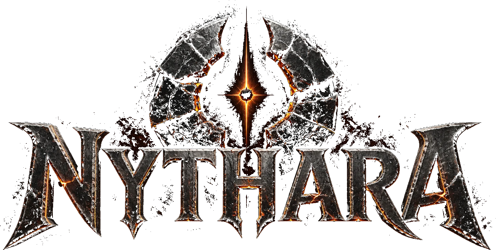
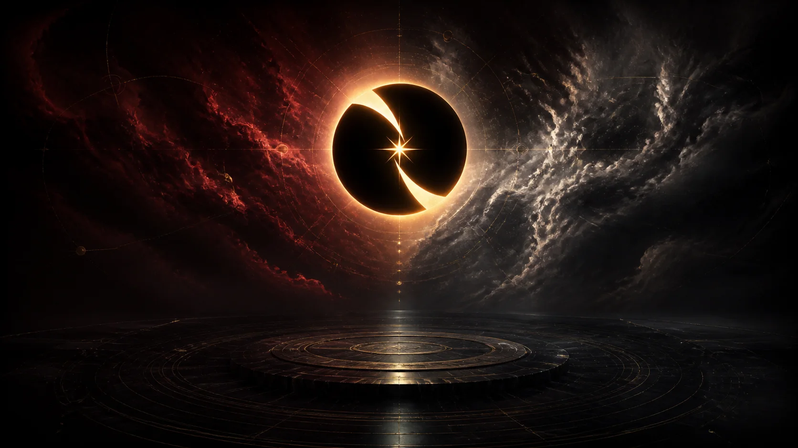
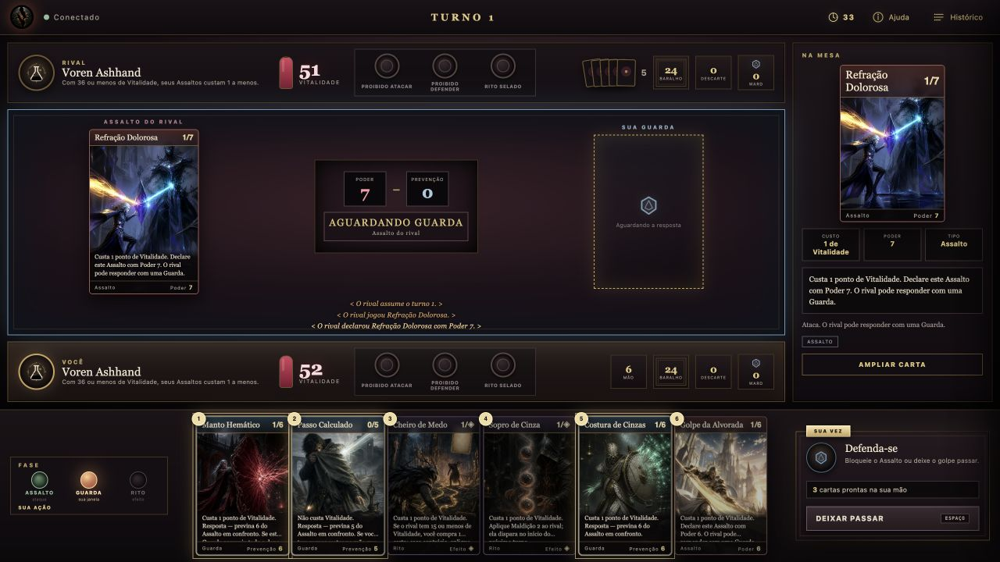
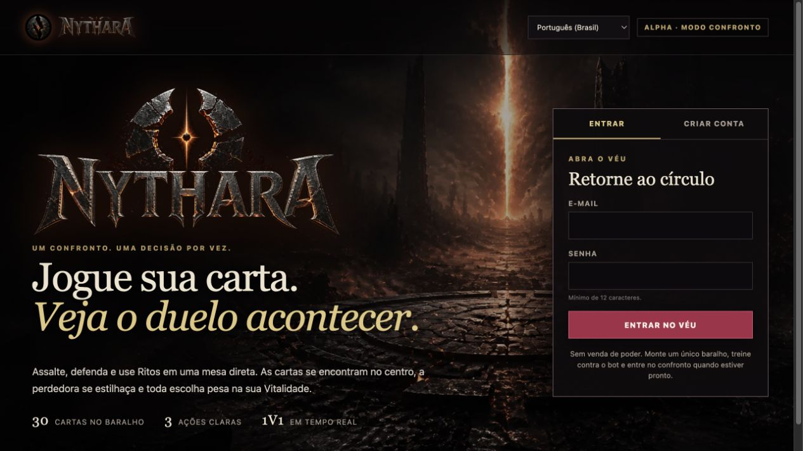
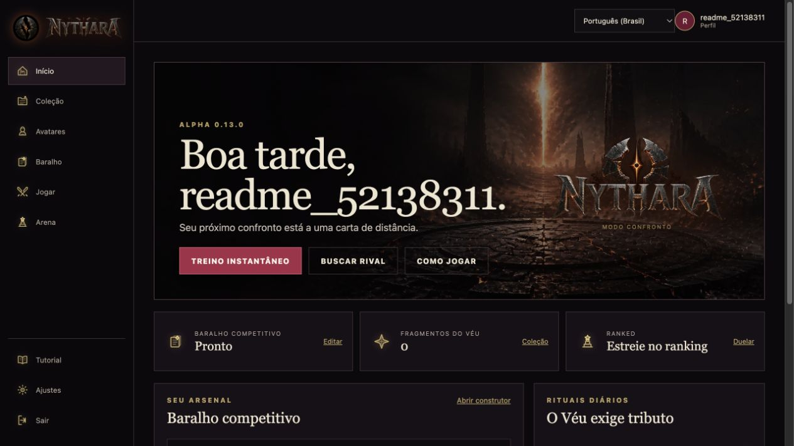
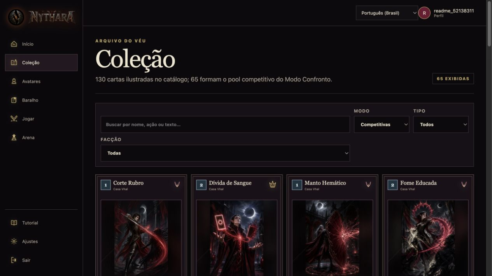

<p align="center">
  
</p>

<p align="center">
  <strong>Um confronto. Uma decisão por vez.</strong><br>
  Card game competitivo 1v1 de fantasia sombria para Web/PWA, desktop e mobile.
</p>

<p align="center">
  
  
  
  
  
</p>

<p align="center">
  <a href="#português">Português</a> · <a href="#english">English</a> ·
  <a href="docs/design/GDD.md">GDD</a> · <a href="CONTRIBUTING.md">Contribuir</a>
</p>



## Português

**Nythara** é um card game digital competitivo de universo 100% original. Não
existe mana: sua **Vitalidade é vida e recurso**. Assaltos e Guardas se
enfrentam no centro da mesa, Ritos mudam o rumo do duelo e cada Avatar oferece
um poder próprio.

> 🤖 **Construído 100% com IA:** o projeto foi gerado com **OpenAI Codex** e
> **Anthropic Claude Code**, sob direção, curadoria e validação humanas.

### Alpha jogável

| Conteúdo | Jogo e plataforma | Engenharia |
| --- | --- | --- |
| 130 cartas originais ilustradas | PvP casual e ranked em tempo real | Servidor autoritativo |
| 65 cartas no pool competitivo | Treino contra bot heurístico | Engine determinística e pura |
| 10 Avatares com poderes próprios | Deck building, coleção e progressão | Replay e regras versionadas |
| 5 facções + cartas neutras | Desktop e mobile em PWA | LiveOps, auditoria e telemetria |
| Cartas com escolhas interativas | PT-BR, Espanhol e Inglês | Reconexão e persistência |

O Alpha 0.13 já permite jogar cartas com decisões reais: a mesa apresenta as
opções da mão, registra a ordem da escolha e só continua após uma confirmação
válida. O mesmo comando fica persistido e pode ser reproduzido no replay.

### O confronto é o palco



Cada duelista começa com **52 de Vitalidade** e um baralho de **30 cartas**.
Jogar consome a própria Vitalidade, então toda ação poderosa também aproxima o
jogador da derrota.

1. **Assalto** — pressione o adversário e envie a carta ao confronto.
2. **Guarda** — responda ao ataque ou aceite o dano.
3. **Rito** — use cura, descarte, Sangramento, Selos e outras decisões táticas.

Fadiga crescente e a Pressão de Nythara impedem partidas infinitas. O cliente
envia somente a intenção; o servidor valida a jogada, calcula o resultado e
publica eventos em ordem determinística.

### Dentro do jogo

<table>
  <tr>
    <td width="50%"></td>
    <td width="50%"></td>
  </tr>
  <tr>
    <td align="center"><sub>Entrada e criação de conta</sub></td>
    <td align="center"><sub>Painel, treino, ranked e progressão</sub></td>
  </tr>
  <tr>
    <td colspan="2"></td>
  </tr>
  <tr>
    <td colspan="2" align="center"><sub>Catálogo ilustrado e pool competitivo</sub></td>
  </tr>
</table>

### Balanceamento com evidência

O Alpha 0.13 passou por dois gates de **100 mil batalhas** cada, com replay
integral e validação de saúde da partida:

| Cenário | Vitória do 1º jogador | Faixa dos Avatares | Rodadas p50 |
| --- | ---: | ---: | ---: |
| Baralhos oficiais | **50,22%** | 45,93%–52,70% | 45 |
| Decks variados | **47,59%** | 45,98%–53,21% | — |

Os relatórios e cada mudança de regra ficam registrados em
[DECISIONS.md](DECISIONS.md). Rulesets anteriores permanecem imutáveis para
que partidas históricas continuem reproduzíveis.

---

## English

**Nythara** is an open-source competitive digital card game set in a completely
original dark-fantasy universe. There is no mana: **Vitality is both health and
resource**. Assaults and Guards meet at the center of the board, Rites reshape
the duel, and every Avatar brings a unique power.

> 🤖 **100% AI-built:** the project was generated with **OpenAI Codex** and
> **Anthropic Claude Code**, with human direction, curation, and validation.

### Playable Alpha

| Content | Game and platform | Engineering |
| --- | --- | --- |
| 130 original illustrated cards | Real-time casual and ranked PvP | Authoritative server |
| 65 cards in the competitive pool | Practice against a heuristic bot | Pure deterministic engine |
| 10 Avatars with unique powers | Deck building, collection, and progression | Replays and versioned rules |
| 5 factions + neutral cards | Desktop and mobile PWA | LiveOps, auditing, and telemetry |
| Cards with interactive choices | Brazilian Portuguese, Spanish, and English | Reconnection and persistence |

Alpha 0.13 supports real card decisions: the board presents the available
options, records their selection order, and only resumes after a valid
confirmation. The command is persisted and reproduced by the replay system.

Every player starts with **52 Vitality** and a **30-card deck**. Playing a card
costs Vitality, so every powerful move also brings its owner closer to defeat.
Assaults apply pressure, Guards answer attacks, and Rites introduce healing,
discarding, Bleeding, Phase Seals, and other tactical effects.

The latest release passed two **100,000-battle** balance gates with complete
replay verification. First-player win rate reached **50.22%** with official
decks and **47.59%** with varied decks.

---

## Arquitetura / Architecture

```text
web/       React + TypeScript + Vite; responsive PWA
backend/   Go; API, WebSocket, persistence, and deterministic engine
shared/    JSON Schemas and protocol contracts
docs/      game design, architecture, balance, and player experience
ops/       Compose, Caddy, backups, observability, and VPS deployment
```

The engine in `backend/internal/engine` is pure: it receives state + command
and returns new state + events. It does not depend on HTTP, WebSocket, the
database, a clock, or global randomness. A match is reproduced bit for bit
from `ruleset + seed + decks + command_log`.

See the [Game Design Document](docs/design/GDD.md),
[API contract](docs/API.md), and
[technical architecture](docs/design/TECH_ARCHITECTURE.md).

## Rodando localmente / Running locally

### Requisitos / Requirements

- Go 1.25+
- Node.js 20+
- Docker with Compose

```bash
git clone git@github.com:fabriciobonjorno/nythara.git
cd nythara
make setup
```

Execute a API e o cliente em terminais separados / Run the API and web client
in separate terminals:

```bash
make run       # API: http://localhost:18080
make web-dev   # PWA: http://localhost:5173
```

## Testes e qualidade / Tests and quality

```bash
make test-race        # complete Go suite with race detector
make lint             # go vet
make web-test         # web unit and interaction tests
make web-browser-test # browser regression in Chromium
make web-build        # typecheck and production build
make sim-smoke        # short battle simulation with replay verification
```

Rule or architecture changes require an ADR in [DECISIONS.md](DECISIONS.md).
The CI also runs dependency audits, vulnerability scanning, deterministic
simulations, and scheduled 100,000-battle balance gates.

## Produção / Production

The repository includes multi-stage container images, blocking migrations,
private service networks, file-mounted secrets, automatic HTTPS with Caddy,
health checks, and testable backups. See the
[VPS deployment guide](ops/DEPLOY_VPS.md).

## Contribuindo / Contributing

Contributions involving code, tests, game balance, cards, art, writing, audio,
security, accessibility, or translation are welcome. Read
[CONTRIBUTING.md](CONTRIBUTING.md) before opening a pull request and report
security issues privately as described in [SECURITY.md](SECURITY.md).

Nythara's universe, characters, cards, rules, writing, artwork, audio, and code
are original. Historical references are used only as genre context.

<p align="center">
  <strong>🌘 Command the Eclipse.</strong>
</p>
